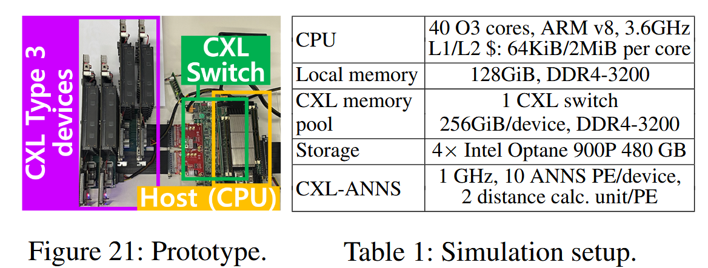
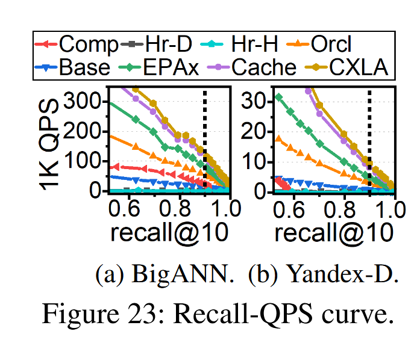
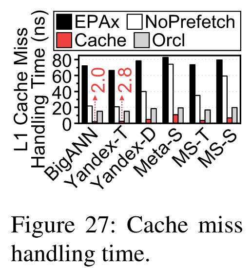

# CXL-ANNS: Software-Hardware Collaborative Memory Disaggregation and Computation for Billion-Scale Approximate Nearest Neighbor Search

## 核心思想
利用CXL在一台计算节点上连接多个type3（只有内存）节点作为内存池，实现在大内存中进行ANNS搜索。CXL的内存访问因为要经过CXL协议的转换，所以速度比本地内存慢。为在CXL上实现更优的效果，作者使用了本地内存缓存、数据预取、在EP节点上进行距离计算和放松依赖关系实现并行等优化。

## Overview

### 设计思想
主要有3点

- 考虑节点间的关系
观察到距离搜索起始点最近（2到3跳内）的节点最容易被访问，将这部分节点缓存在本地内存。

- 下放距离计算
分析发现距离计算在向量搜索过程中产生了大部分的延迟，但这部分延迟的主要来源并不是计算（距离计算并不是计算密集的），因此可以将距离计算下放到EP节点。

- 减少向量数据传输
既然在EP节点上进行了距离计算，且ANNS本身只需要距离这个标量，因此可以只传距离来减少通信开销。

### 架构概览

可以分为RC侧的软件栈和EP侧的硬件栈

- 软件栈：
  - Query scheduler：处理查询请求，将请求分为graph traverse, distance calculation,  candidate update这3个阶段，并调度到各个位置上。
  - Pool manager：管理整个内存空间，通过考虑跳数来根据节点间关系区分不同的向量访问。
  - Kernel driver：管理底下的EP和它们的地址空间。这里注意为了保证发往EP的请求不被缓存，需要用CXL.io来访问EP的接口寄存器。
- 硬件栈：
  - PHY ctrl：控制PCIe/CXL的通信。
  - CXL engine：负责flit（CXL协议的数据包）和内存请求之间的转换。转换得到的请求被发往内存控制器。
  - DRAM ctrl：内存控制器，连接多个DRAM module。
  - DSA：放在CXL引擎和内存控制器之间，它既可以通过内存控制器读取向量，也可以通过CXL引擎的接口寄存器检查操作命令。前面已经提到，这些命令是无缓存的，因此一发送就会立刻对DSA可见。DSA使用很多个可以进行简单算数计算的处理单元计算向量间的距离。

## 软件栈设计与实现

### 本地内存缓存

尽可能多地将距离搜索起始点最近的节点缓存在本地内存中。具体执行过程如下：

- 使用单源最短路（SSSP）算法，计算起始点到每个节点的跳数（猜测实际操作中可能并不需要计算所有节点？不然对于大规模数据集来说开销太大）。这一过程是多线程的。
- 按跳数递增的顺序将节点尽可能多地缓存进本地内存。

### CXL内存池管理

- 需要让CXL的CPU分辨出不同的HDM并知道它们的容量，EP节点也需要知道自己的HDM在HPA中的位置。因此kernel driver会设法获取CXL设备的信息，并分配对应的连续空间。kernel driver还会通知底层EP它的HDM在HPA中的位置，让它们可以将HPA转换为HDM的地址。在这之后pool manager将HDM映射到用户虚拟地址空间的不同位置。
- 由于向量数据和图结构数据（即邻居信息）需要分配不同类型的空间：向量数据需要大块连续空间，而图结构数据分为很多不同长度的邻接表，因此pool manager采用stack-like和buddy-like两种类型的内存分配器。栈式内存分配用于向量数据，pool manager会将向量数据分片轮流分配在多个EP上。buddy-like按内存块大小分为多个等级，分别用链表连接，它会正好分配邻接表所需要的空间，并且会根据需要进行拆分和合并，buddy-like的分配同样会轮流分配在不同的EP上。

## 协同加速

### 加速距离计算

EP上的距离计算通过PE（processing element）完成。每个processing element分为多个终端，每个终端都有乘法器和减法器（如图），可以分别进行减法和乘法操作。在计算时，EP会根据不同的距离计算方式（比如L2距离）调用不同的计算器（比如角度计算就需要bypass减法器）。另外，PE的每个终端并行地从4个不同的DIMM通道中并行读取数据（文中是这么写的，但是图上好像是一个终端读一个通道，最后一整个PE是并行的？），从而最大化DRAM带宽。

由于向量是高维数据，每个向量都很大，仅采用上面的方法仍然可能导致DRAM瓶颈。因此CXL-ANNS将每个向量切分为多个分片，分布在不同的EP节点上。每个EP节点计算完自己所拥有的一部分向量距离后，再将结果汇总到CXL CPU，计算最终距离。

为减少CPU和通信的消耗，CPU在发送计算任务时，只通知EP任务到来，具体的操作指令和邻居信息由EP自行从CPU侧的本地DRAM里获取。计算结果同样由CXL引擎直接推送到CPU侧的DRAM，不需要CPU主动从内存池获取。

### 内存预取

如图，在遍历图之前需要先读取图的信息（这里指的可能是读取邻居信息？因为currNode的距离已经在之前计算过了）。于是CXL-ANNS会在完成遍历后进行对下一个节点的预测，并且在更新候选列表的同时进行数据的预取。预测的数据来自候选列表，因为测试表明下一个节点的来源有超过80%来自当前的候选列表（这里的意思应该是，下一个节点大概率就在当前的候选列表中，而不是新计算得到的节点，因此直接从当前的候选列表里面选一个来预取），尽管还没有进行更新。

### 细粒度的查询调度

由于距离计算放在EP上进行，因此在等待距离计算时CXL CPU会一直空闲（空闲时间超过42%），浪费计算资源。为解决这一问题，作者将候选列表更新分为：插入候选节点，排序选出k个最近节点，选择下一个遍历的节点这3步。其中选出下一个遍历的节点是最重要的，因为图的遍历需要这一信息，另两个不是很紧要。因此作者将剩下2步都放在图遍历之后，和EP上的距离计算重叠，充分利用CPU时间。

## 测试

CXL没有公开可用且功能齐全的系统，因此作者自己用FPGA等配件搭了一个。有一些没法在这个机器上测试的，作者使用gem5模拟。表中的CXL-ANNS应该指的就是模拟配置。

作者将CXL-ANNS与PQ量化、DiskANN，HM-ANN，Oracle纯内存进行了对比。

### 性能测试结果

对于PQ压缩的Baseline，在很多情况下往往达不到90%的recall要求，因为PQ压缩精度损失比较大。作者专门做了QPS和recall的曲线图，结果发现PQ压缩确实会出现recall收敛到固定值的情况。

对于两种基于图的Baseline（DiskANN和HM-ANN），它们都能达到90%的recall目标，但由于需要访问SSD/PMEM，性能相比Oracle差很多。

CXL的Base虽然比DiskANN等好很多，但是由于CXL内存访问时flit转换的开销，性能不如Oracle。

将距离计算下放到EP节点后，通信开销显著降低（数据传输减少21x），延迟性能相较Oracle提升1.9x（这里的意思应该是Oracle的延迟是加入EP的CXL的1.9倍）

缓存和预取加入后，由于部分图遍历操作可以从本地读取图信息，性能进一步提升，减少了32.7%的查询延迟。

加入细粒度的查询调度后，完全体的CXL-ANNS的QPS进一步提升了15.5%，性能平均超过Oracle的3.8x。

### 协同查询加速分析

**预取**：为研究预取带来的性能提升，作者增加了一个有缓存但无预取的CXL-ANNS版本，对比了各版本的L1缓存未命中代价，结果显示尽管无预取状态下相比完全无缓存有一定的性能提升，但是在图规模较大时提升效果有限，甚至性能比Oracle差几倍。加入预取后可以进一步提升性能，超越Oracle。

**细粒度调度**：作者设置了一个单CXL CPU和每个设备只有PE的版本，在Yandex-D数据集上研究细粒度调度对硬件利用率的影响。结果显示未开启细粒度调度时，CPU有42%的时间在空闲状态。加入细粒度调度后，空闲时间减少了1.3倍，硬件资源利用率提高了20.9%。

### 可扩展性测试

**更大的数据集**：作者向Yandex-D中添加了3B的噪音，构造了一个4B的数据集，并增加更多EP，在上面进行测试。尽管Oracle和CXL的性能都下降了，但CXL-ANNS的延迟仍然比Oracle低2.7倍。

**多主机（host）**：作者将EP资源拆分分配给多个host，将向量分区存储，每个host查询一个分区并汇总查询结果，选出最好的k个。测试发现，host数量增加到4台时性能（QPS）一直在上升，增加到6台时性能会下降，因为PE不够用，遇到了瓶颈，此时继续增加EP数量可以解决瓶颈，性能继续提升。

## 讨论
对于GPU加速，作者认为使用CPU+GPU完全处理ANNS任务不可行（我不好说，后面两年好像就有用GPU的论文，感觉是拉踩）。一方面因为即使是纯内存环境，也需要考虑与GPU进行数据传输的开销，另一方面ANNS涉及的距离计算很简单，使用GPU效益不高。作者认为使用CXL，在靠近向量数据的地方进行距离计算是更好的选择。