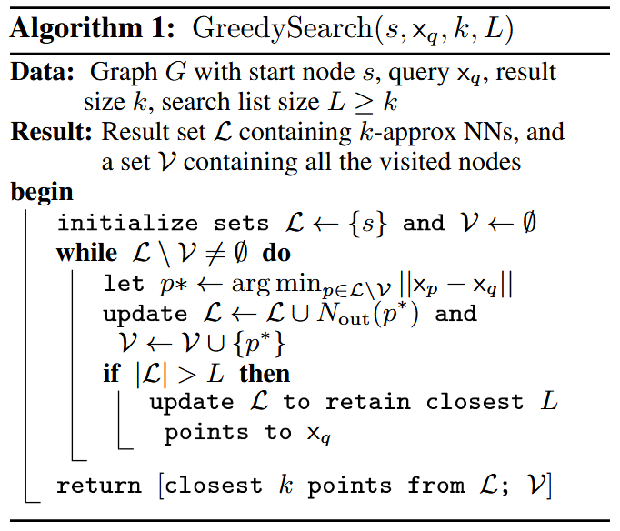

# DiskANN: Fast Accurate Billion-point Nearest Neighbor Search on a Single Node

## 核心思想

使用Graph based + PQ压缩的方式，构建的图放置在SSD上。因为瓶颈在SSD的读取，因此需要尽可能减少读取SSD的轮次。文章提出Vamana图来解决这个问题。

## Vamana图

### 构造
传统的SNG（Sparse Neighborhood Graph）的构造是这样的：对于一个点p，和一个候选邻居集合S = P \ {p}（P是所有节点的集合），不断从S中取出距离p最近的点p\*设置为p的邻居，并删掉S中所有满足$dist(p, p') > dist(p*, p')$的点p'，直到S为空（或者p的邻居数量达到上限）。但这一做法时间复杂度太高（构建整张图的时间复杂度为$O(n^2)$），因此通常采用近似算法（比如HNSW的算法）。并且由于选择的都是距离p很近的节点，搜索过程中收敛速度比较慢。

为解决这些问题，Vamana图的构造算法如下：

首先，Vamana图修改了选择邻居的规则，将删除节点的条件改为了$dist(p, p') > \alpha * dist(p^*, p')$，放松了选择邻居的严格性。这样可以增加一些比较长的边，加快收敛速度（文章中提到可以将搜索时间复杂度变为log级别）。算法如下图

然而，如果仍然取S = P \ {p}，那么时间复杂度仍然是$O(n^2)$级别。因此，Vamana图采用从起始节点s开始，运行到目标点p的GreedySearch(s, xp, 1, L)，把经过的节点作为邻居的候选集合，从中选取邻居。选择邻居后，Vamana图会添加双向连接。如果有邻居的度数超过限制，则使用前面的邻居选择算法重新收紧边数量。

最开始时，为保证连通性，所有节点会随机连接到R（最大度数）个邻居，然后进行一遍$\alpha=1$的Vamana图构建，之后再进行$\alpha>1$（用户指定）的Vamana图构建。使用两遍构建是为了提高图的质量，而第一遍使用$\alpha=1$是为了加快构建速度。

然而，在实际的构建过程中，数据集会很大从而无法一次构建整张图（内存不够）。因此DiskANN采用分块构建的方式。通过Kmeans将数据集划分为小块（比如40块），将每个向量分配到距离最近的l个分区（l>=2，一般直接取l=2），然后对每个分区分别构建Vamana图，最后再合并整张图。并且为了提高搜索时的效率，DiskANN还会使用PQ压缩在内存中存储压缩过的图，遍历图过程中的距离计算使用压缩过的向量进行。

在存储时，DiskANN将全精度向量和邻居编号打包存在一个块里面，每个块的大小是固定的，如果邻居数量不够，则用0填充。这样保证在读取硬盘数据时可以简单计算偏移量。

### 搜索

搜索使用上面Greedy Search的变形。距离计算使用压缩过的向量，由于Vamana图是使用全精度向量构建的，这里使用压缩向量对搜索精度的影响没有那么严重。为提高SSD的读取效率，DiskANN每次不止选取一个候选点，而是多个（一般2、4或者8个）来充分利用SSD的带宽，它们的邻居会一起被加入到候选节点中。另外，DiskANN还会在SSD读取时更新候选节点集合，只保留当前最近的L个，从而实现计算通信的overlap。最后，由于每次读取时DiskANN都会同时读取全精度向量，在最后返回k个最近向量的时候，DiskANN会使用全精度向量进行重排，保证精度。

DiskANN同样有缓存。一般直接缓存距离起始节点s为3或4跳内的节点，提升搜索效率。

## 测试结果

### 纯内存测试
在大小为1M的多个数据集上与NSW和HNSW进行对比，效果都是最好的

### SSD测试
在大小为1B的数据集上与几个sota的baseline进行对比，结果显著优于其他方法。仅需几毫秒级别的延迟就能达到95\%的recall。

### 一次构建图和合并图对比

一次构建得到的Vamana图搜索效果确实更好，但合并得到的Vamana图已经比其他方法好很多了。在SIFT1B上，一次构建需要1100GB内存，耗时2天；合并图需要64GB内存，耗时5天。