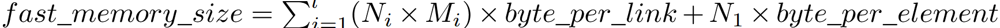

# HM-ANN: Efficient Billion-Point Nearest Neighbor Search on Heterogeneous Memory

## 核心思路

将HNSW算法扩展到了异构内存中。其中hnsw图的第0层放置于大容量的低速内存，而上面的层次放置在高速内存。HM-ANN还对HNSW的建图、搜索算法进行了一些修改。

## 算法流程
 
### 构造图算法

构造图分为自顶向下插入节点和自底向上提升节点两个部分。

自顶向下插入节点基本用的就是HNSW的算法，但插入的M条边中，只有M-1条边是最近的边（即按HNSW规则插入的边），剩下一条边是随机连接的一条长边，用来加快收敛速度。

自底向上提升节点的过程中，与HNSW按概率随机选择节点所处最高层次不同，HM-ANN选择具有最大度数的一批节点提升到上一层，这样保证提升到上一层的节点具有更好的连通性，提升搜索效率。在层内选择邻居的方式与HNSW基本相同，都是在选择若干个最近的节点后，再使用启发式选择函数。如果出现邻居数量超过限制，同样使用启发式函数（或者可以简单选择最近的）进行收缩。

与HNSW中类似，HM-ANN的L1层（即放置在快速内存中的最底层）的最大度数为2M，其余层为M。

对于每一层的节点数量，原文提到用$N_i$进行限制，但并未详细讨论$N_i$的取值（本来说section 4讨论，但好像写漏了），另一个地方提到按$1/M$的比例提升节点至上一层，因此这里认为$N_i = N_{i-1}/M$。

### 搜索算法

搜索从顶层开始，一直到L2层都使用1-greedy search（即使用HNSW的search-layer，ef设置为1）。L1层将ef设置为$efSearch_{L1}$进行搜索（这里原文说的是使用Algorithm 2，但是原文中的Algorithm 2是并行的搜索，其余部分并未提到L1层的搜索是并行的，这里指的也可能是HNSW中的Algorithm 2）。

对于L1层中搜索到的$efSearch_{L1}$个入口，在L0层中使用$Thr$个线程进行并行的搜索。搜索算法如下图。对$C_t$，$VE_t$，$W_t$几个集合的维护应该和HNSW中类似，即，如果邻居没有访问过，则标记为已访问（否则如果访问过就跳过看下一个邻居），然后如果邻居比$W_t$中距离最远的节点近，或者$W_t$的节点数量少于ef，则将邻居加入$C_t$和$W_t$中，如果Wt数量超了，就去掉最远的点。同时应该需要将c从$C_t$中去掉。

为了提高L0层搜索的效率，HM-ANN在快速内存中设置了一个软件负责管理的缓存。在L1中搜索时，HM-ANN会同时将候选向量的邻居以及它们的连接关系（边）预取到快速内存中

## 参数选择

由于层内的搜索可以看作一种best-first beam search（即搜索时全局始终只保留当前最优的常数个候选项），因此可以粗略地将在一层内的搜索代价估算为$efSearch * C * T_{DC}$，其中C是对每一个候选项在找到结果前需要进行的距离计算次数，$T_{DC}$是进行一次距离计算的时间。因此，对于搜索时间限制，可以用下面的式子来估算：

HM-ANN会先用上面的式子计算满足时间限制的$efSearch_{L1}$和$efSearch_{L0}$范围，然后随机抽样一个用于学习的查询集合，来搜索满足精度限制的$efSearch_{L1}$和$efSearch_{L0}$参数对。

## 时间复杂度分析

### 搜索时间
搜索时间代价=跳数*度数。度数有常数上线，因此由跳数决定。由small world graph的特性，在一层内搜索的跳数在$O(\log{N})$级别，因此一层内搜索的代价为$O(\log{N})$。对于总时间复杂度，文章可能认为层数是一个小常数，因此仍为$O(\log{N})$。

### 构造时间

插入节点的总复杂度与HNSW类似，为$O(N\log{N})$，除此之外还需要计算度数和按度数排序，因此还需要$O(M*N+N\log{N})$，总时间复杂度为$O(M*N+N\log{N})$。

### 空间复杂度

由每一层的节点数和边数很容易算出来

## 测试结果

### 与baseline对比

搜索性能比包括HNSW在内的所有baseline都要强，不论是在百万级还是十亿级的数据集上。

### ablation分析

- 对于high degree promotion，测试显示明显优于随机提升节点（即HNSW的方法）
- 对于L0层的并行搜索，文章经过测试发现，仅对HNSW加上这一功能仍然与HM-ANN有很大差距，因此仅有这一功能不足以达到HM-ANN的性能。
- 对于HM-ANN所有优化手段各自的效果，作者做了拆解分析如下：。其中BP指的是Bottom up promotion，PL0指的是Parallel L0 search，DP指的是Data prefetch。
- 考虑异构内存的管理，文章将HM-ANN和采用两种自动管理异构内存（优先填充快速内存或是将快速内存作为缓存）的HNSW进行了对比，仍然明显优于HNSW。说明文章对异构内存做的针对性优化是有效的。
- 对于参数的自动选择，作者也进行了测试，发现在不同的recall要求下，自动选择参数的方法总是可以达到最优性能。

## 其他
HM-ANN会将部分层次放置在快速内存，部分放置在慢速内存，可能招致攻击。