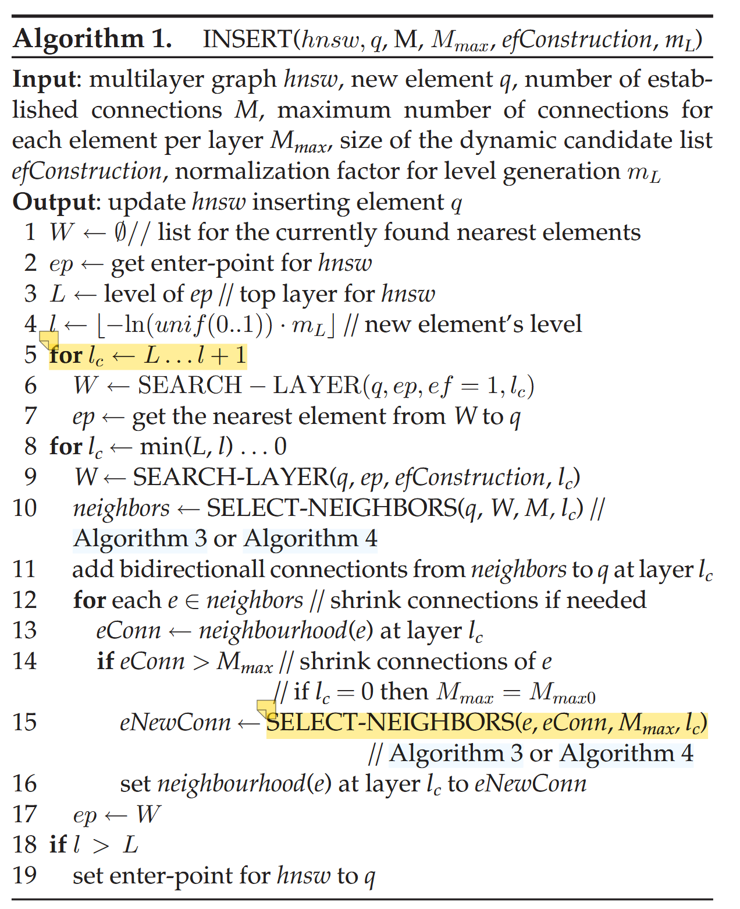
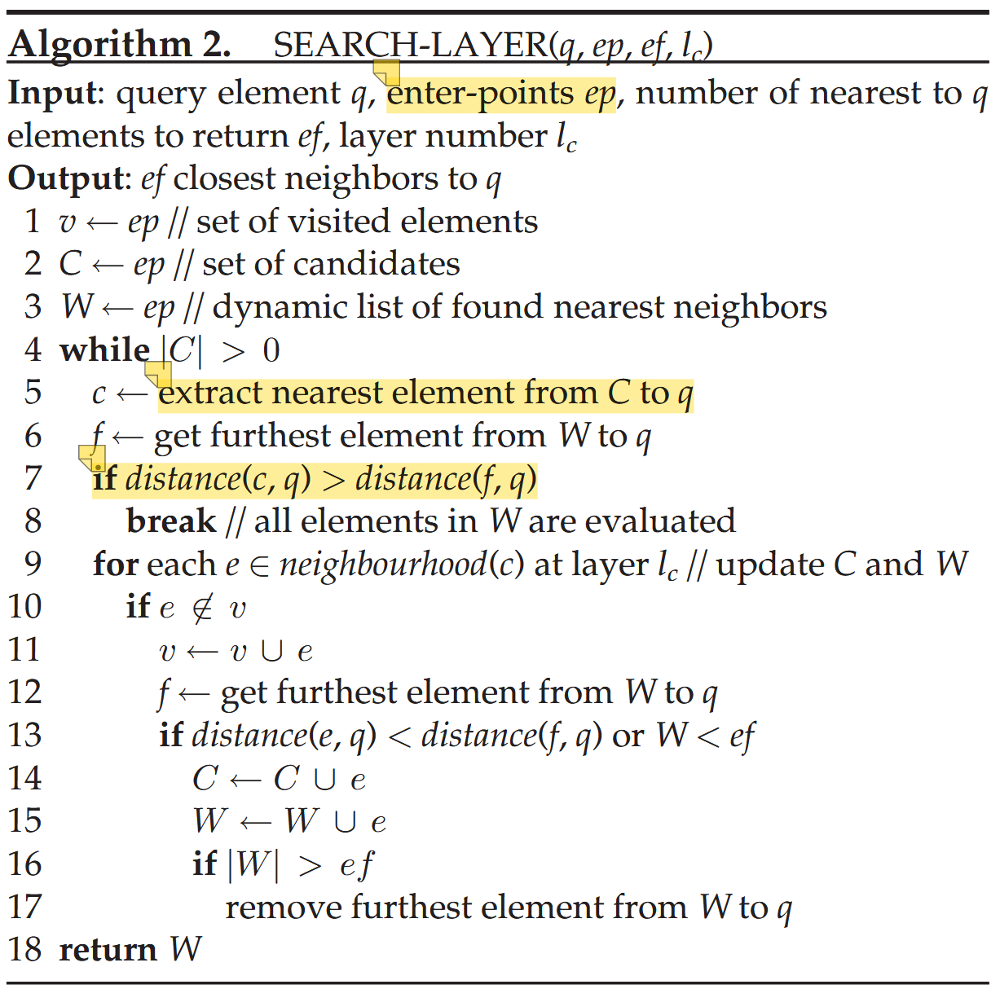
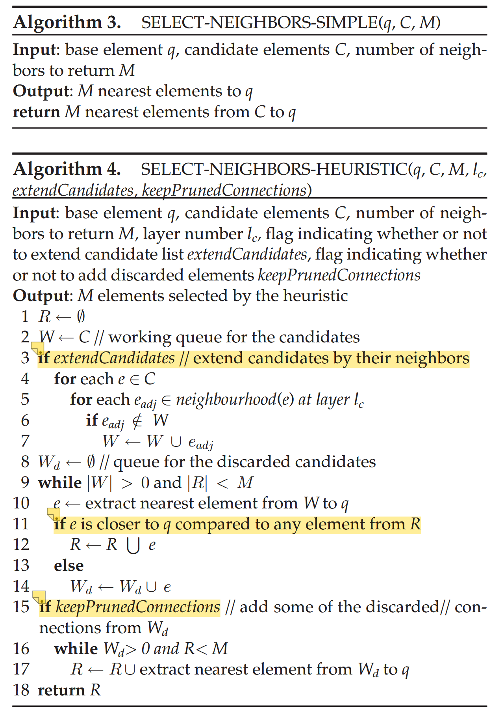
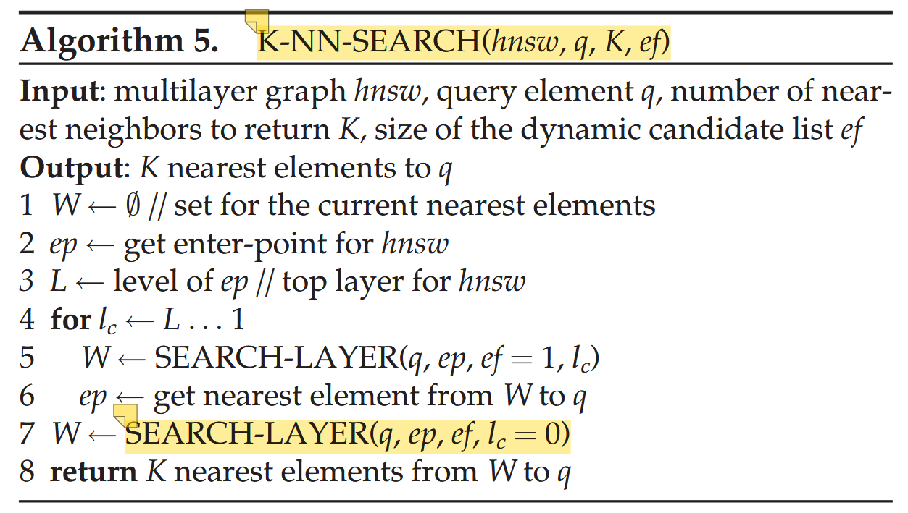

# Efficient and Robust Approximate Nearest  Neighbor Search Using Hierarchical Navigable  Small World Graphs

## 核心思路
构造分层的图结构，最底层包含所有节点（向量），上层是下层的子集，每个节点与离自己比较近的节点相连。搜索时从顶层开始，不断找到距离目标向量最近的节点，并作为下一层搜索的入口继续搜索，直到在最后一层找到K个最近的向量。

## 算法流程

### 构造图算法
通过不断将新节点插入图中来构造图。一个节点所在的最高层级由一个概率函数决定，如果一个节点存在于某一层，那它一定存在于下面的所有层级。每一层都有一个参数$M_{max}$，用来决定这一层节点的最大度数。

算法如图所示：

插入节点时，首先确定节点所在的最高层级，然后从顶层开始进行1-greedy search，直到到达节点所在的最高层。然后迭代地从上往下在每一层中搜索，找到离该节点最近的$efConstruction$个邻居（该参数用于控制时间代价和构图精度），并从中使用特定的选择函数选择出$M_{max}$个邻居，与该节点增加双向连接。由于连接是双向的，如果出现某一个节点度数超过$M_{max}$，则需要使用选择函数删除一些连接。

hnsw图的入口被设置为最后一个插入到最高层级的节点，可能是因为理论上该节点的连通性最好。

### 分层搜索算法

就是一种贪婪搜索算法。该算法会从给定的入口点集合开始不断搜索候选节点的邻居，每轮只保留距离目标向量最近的$ef$个节点。直到候选节点全部搜索完毕，或者候选节点距离目标向量的距离比已找到的所有节点距离目标向量都要远。

### 选择邻居函数

有两种选择方式，一种是简单地只选择最近的$M_{max}$个节点；另一种是启发式地选择，不断从候选列表中取出离目标节点q最近的节点e，并删除候选列表中距离e比距离q更近的所有节点。这样可以选择各个方向上距离目标节点最近的节点，防止邻居聚集在同一个方向。

启发式搜索还有两个额外选项，可以将候选节点的邻居也全部加入候选列表，或是在选出的邻居数不到$M_{max}$时，从前面被淘汰的节点列表中选出最近的节点补充。

### 搜索算法

最终用来在构造好的图中搜索的算法。从最高层开始不断进行1-greedy search，直到到达底层，然后在底层查找距离目标节点最近的ef个节点，最后选出其中最近的K个。

## 参数对算法的影响

- $m_L$：控制节点所在层级的参数。该参数过大则会导致不同层次间容易出现重复的邻居（比如p、q两个节点在多个层次中同时出现，且都互为邻居），过小则节点聚集在底层，搜索时跳数过多。文章给出了一个经验公式，取$1/\ln{M}$。
- $M_{max}$：这里主要需要考虑第0层的$M_{max}$，实验表明上层全部设置为一个定值M，第0层设置为2M效果最好。对于M的取值，可以取5到48之间的值，具体取决于对搜索精度和速度的要求。
- $efConstruction$：决定构造图的质量和速度。文章的实验环境下取100比较合适。

## 时间复杂度分析

### 搜索时间复杂度
文章认为，如果使用精确的Delaunay图，则在一层内搜索的代价由一个常数限制。因为层数为$O(\log{N})$，所以总的时间复杂度为$O(\log{N})$。

由于文章使用的HNSW图是一个近似算法，因此还做了额外的测试。测试显示，至少在低维数据上，随着数据集大小增大，达到固定recall所需要的ef值会趋向于一个常数，因此认为该近似算法不会影响时间复杂度。对于高维分析则还需进一步研究。

### 构造时间复杂度

大概为$O(N\log{N})$。

### 空间复杂度

主要取决于边的数量。由于每个节点期望最高层级为$m_L + 1$，因此平均每个节点连接的边占用的空间为$(M_{max0} + m_L * M_{max}) * bytes\_per\_link$。

## 测试结果

效果比所有同一时间的sota算法都要好，除了部分低维且时间限制很严格的情况下不如基于树的Annoy。

在一些特殊的数据集上进行测试（比如不对称或不满足三角不等式），结果也比所有baseline要强，说明算法的鲁棒性很好。

与基于PQ压缩的算法对比，在大数据集上占用的内存多很多，但效果也好很多。