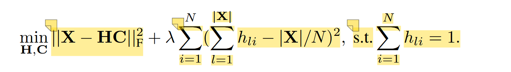
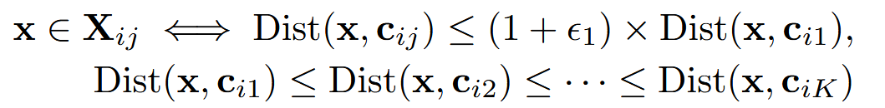
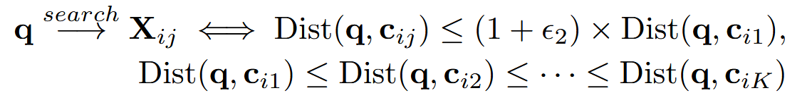
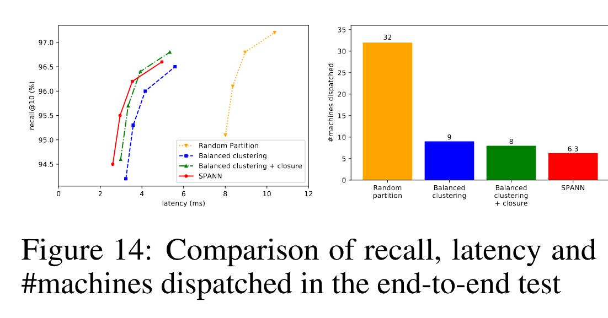

# SPANN: Highly-efficient Billion-scale Approximate Nearest Neighbor Search

## 核心思想
简单地采用分区+倒排索引的方式。完整的向量集合存储在磁盘中。

索引结构：对向量集合进行分区，每个分区的中心向量存储在内存中，作为快速粗粒度的索引。

部分搜索：对于一个查询q，首先在内存索引中查找最近的k个中心，然后将这k个中心对应的分区全部load到内存，再进行细粒度的搜索。k远小于分区总数。

## 挑战
该设计主要面对3个挑战：

- 分区长度限制：因为需要将分区从硬盘load到内存，因此不仅分区长度不能太长，还需要保证不同分区的长度差异不能太大（即长度的方差不能太大），否则延迟波动会很大。
- 边界问题：一个向量可能同时处于多个分区的边界中（即距离最近分区和其他几个分区的距离可能差不太多），那么需要考虑将这个向量分配到哪（几）个分区中。
- 搜索难度不同：不同的查询可能具有不同的搜索难度。一些简单的查询可能只需要查找1、2个列表即可找到结果，而有一些查询可能需要查找很多个列表。需要根据查询性质决定查询的列表数量。

## 问题解决

### 针对分区长度限制

使用多重约束平衡聚类算法，如下图

图中最左边一项代表所有向量到所属中心欧氏距离的平方和，右边一项是分区中向量数量的方差。最右边的限制是所有向量只能在一个分区中。$\lambda$是一个参数，用来平衡聚类效果和长度限制。但该算法的时间复杂度是$O(|X| * m * N)$，太高了。因此文章提出分层的聚类方法，即将向量集合迭代地不断划分成k个分区，这样可以将时间复杂度变为$O(|X| * m * k * \log{N})$。

### 针对边界问题

SPANN扩展了一个向量可以被分配到的分区范围：

只要与最近分区的距离差距不太大（由一个$\epsilon_1$）控制，就可以被分配到这个分区中。为了减少重复存储的向量数量，SPANN会跳过满足$Dist(c_{ij}, x) > Dist(c_{ij-1}, c_{ij})$的分区ij。这样可以使一个向量被分配到不同方向上的分区中。

### 动态感知搜索范围

与上面类似，只有当中心距离查询向量与最近的中心差距不太大时才进行查询：

## 测试结果

### 与DiskANN在1B规模数据集上对比

在SIFT1B上，SPANN显著优于DiskANN。在SPACEV1B和DEEP1B上则在低延迟的情况下强于DiskANN，但在召回率要求极高的情况下不如DiskANN。

### 与纯内存搜索算法对比

这里比较的是VQ，即系统每秒可以服务的向量数量和查询数量的乘积，用来反映系统的吞吐量。结果显示，SPANN在几个数据集上的VQ表现都优于其他纯内存的baseline，但延迟要差一些。

### 消融实验

- 分区方式：文章讨论了几种分区方式，即随机选择中心，分层聚类，分层平衡聚类，结果显示分层平衡聚类结果最好，随机选择效果最差，符合直觉上的结果。文章还讨论了需要的中心数量，实验结果显示中心数量达到总向量数的16%实验结果就几乎不再提升了。
- 副本数量：测试结果显示向量的最大副本数量达到8个时，就已经几乎达到最好结果。
- 查询感知的动态剪枝：结果显示该技术可以进一步降低查询延迟，且不会降低recall。

### 分布式扩展

SPANN非常适合扩展到分布式环境，唯一需要解决的是热点问题。作者将SPANN中的向量分成比机器数量多的很多个小分区中，然后使用best-fit bin-packing算法，根据历史查询记录将它们分配到不同的机器上。测试结果显示SPANN可以将查询请求均匀分配到各台机器上。

针对分布式场景，文章也做了消融实验，结果显示每一项技术都能一定程度减少查询被分配到的机器数量，可以提升分布式场景下的性能。

