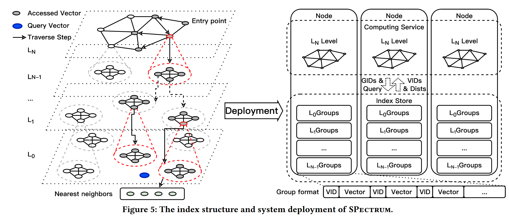
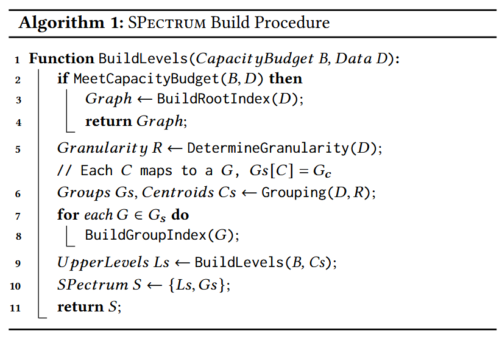

# SPectrum: A Distributed Vector Indexing System for Accurate, Efficient, and Scalable Search

## 核心思想
把SPANN改成分布式的，原本的2级索引（内存里的分区中心+硬盘上的分区）改为多级。通过调整分区的粒度，达到一个可以最大化计算和通信收益的甜点位置。

## 现有方法的问题

现有分布式主要是基于图分区或是分组的方案。

图分区即将图分割放在多台机器上，但这样会有大量的跨节点的边，跨机通信代价很大。

分组会好一些。分组的方案即将向量集分为多个组，不同的组可以放在不同的机器上。每个向量组的中心组成一个图作为索引，决定查询请求要访问哪些机器。但这样的做法同样会有以下的问题：1. 粗粒度向量索引不够精确；2. 计算冗余；3. 加剧热点问题。

## 分组粒度的影响

可以简单地将基于图的方法看作每个顶点（向量）是一个组，那么基于图的方法和粗粒度的分组（每个机器上一个组）是两个极端。分组过细会导致大量跨节点通信，而分组过粗会导致大量计算冗余。通信代价（用节点间的连接数量代替）随分组密度（即分组数量/向量数量）减少线性下降，而计算代价（用查询时访问的向量数量代替）在分组密度下降到某一个值后急剧上升。这说明平衡计算和通信的甜点是存在的。

但简单地取图中的甜点值作为分组粒度仍然不够，因为这样会导致分组过多，分组中心组成的图在一台机器上放不下。但由于在节点中心组成的图上进行遍历本身也可以看作一种ANNS的过程，所以可以把上面对分组粒度的分析直接扩展到分组中心组成的图上，得到多层的索引。

## SPectrum设计

### 概览

如图，SPectrum采用多层分组索引，最顶层是纯连通图，这一层的大小保证可以放在单台机器上，底下的所有层级都是分组索引，每个分组内部为连通图（如果是向量数量小于100的小组，就不构建图索引，搜索时直接遍历）。每一层中每个向量都是下层一个分组的中心。最后一层（L0）包含所有向量。查询时从上向下查找，直到在L0层找到结果。

SPectrum分为Index Store和Computing Service两部分。前者负责存储所有分组（L0到LN-1层），后者负责执行查询请求和缓存LN层。

### 索引构造

不断将输入的向量集合分组（5、6行），在组内构造图索引（对于小组不构造）（7、8行），并递归地将每个组的中心组成的向量集合作为下一层进行构造（第9行），直到剩下的向量满足存储预算（能在单台机器的内存中被存下），对这一部分向量构造图索引作为最上层（2到4行）。最后将所有层拼接得到完整的图（第10行）。

### 搜索过程

搜索时首先从顶层开始，查询得到N个最近的向量（参数N可以设置，用来控制搜索代价），然后在这N个向量对应的下一层的组内部进行并行的局部搜索，搜索得到的结果聚合得到N个新的最近向量，然后继续在下一层进行搜索，直到在最后一层找到结果。

每次搜索时，在获得上一层最近的N个中心后，系统会一次性批量地获取下一层对应的所有向量组。

## 实现细节
### 系统结构
- 索引（包括分组结构、向量数据和ID等）被存储在SSD中，向量组的ID由上一层对应的向量中心的ID代替。
- 计算服务由一组专用节点负责，查询请求会被路由到负载最小的节点。计算节点会缓存最顶层的索引图。
- 为减少数据传输，计算组内向量到查询向量的距离时，直接在对应的存储节点上计算，只需要将得到的N个最近的向量ID和距离传给计算节点即可。
- 将分组分配到存储节点时，为减少热点，直接采用随机分配的方式。上一条已经减轻了网络负载，网络带宽不会成为瓶颈。

### 并行构建索引
- 构建索引时，SPectrum会在每一层采样1M的向量，并在每个采样集合中不断构建连接，直到计算代价超过预先定义的精度与开销的比值。
- 索引构建是并行进行的（应该指kmeans构建分组时是并行的）。

### 讨论（其他功能）
- SPectrum支持向量更新，使用类似B-树的策略（其实就是对每一层应用SPFresh的拆分合并，拆分合并的结果会向上传播）。最上层的图采用了FreshDiskANN和OdinANN的高效修改技术。存储使用KV存储实现。
- 数据量增加到一定程度时，SPectrum会增加索引层级，从而增加IO成本。这样将内存操作换成IO，使得存储的IOPS接近饱和，影响吞吐量的扩展性。