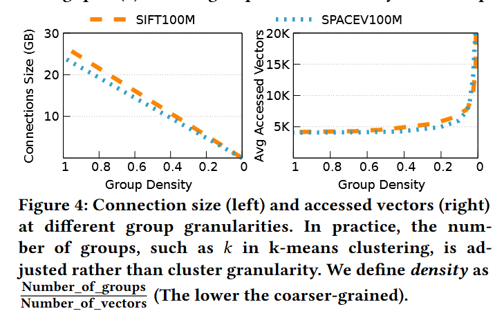

# SPectrum: A Distributed Vector Indexing System for Accurate, Efficient, and Scalable Search

## 核心思想
把SPANN改成分布式的，原本的2级索引（内存里的分区中心+硬盘上的分区）改为多级。通过调整分区的粒度，达到一个可以最大化计算和通信收益的甜点位置。

## 现有方法的问题

现有分布式主要是基于图分区或是分组的方案。

图分区即将图分割放在多台机器上，但这样会有大量的跨节点的边，跨机通信代价很大。

分组会好一些。分组的方案即将向量集分为多个组，不同的组可以放在不同的机器上。每个向量组的中心组成一个图作为索引，决定查询请求要访问哪些机器。但这样的做法同样会有以下的问题：1. 粗粒度向量索引不够精确；2. 计算冗余；3. 加剧热点问题。

## 分组粒度的影响

可以简单地将基于图的方法看作每个顶点（向量）是一个组，那么基于图的方法和粗粒度的分组（每个机器上一个组）是两个极端。分组过细会导致大量跨节点通信，而分组过粗会导致大量计算冗余。通信代价（用节点间的连接数量代替）随分组密度（即分组数量/向量数量）减少线性下降，而计算代价（用查询时访问的向量数量代替）在分组密度下降到某一个值后急剧上升。这说明平衡计算和通信的甜点是存在的。

但简单地取图中的甜点值作为分组粒度仍然不够，因为这样会导致分组过多，分组中心组成的图在一台机器上放不下。但由于在节点中心组成的图上进行遍历本身也可以看作一种ANNS的过程，所以可以把上面对分组粒度的分析直接扩展到分组中心组成的图上，得到多层的索引。